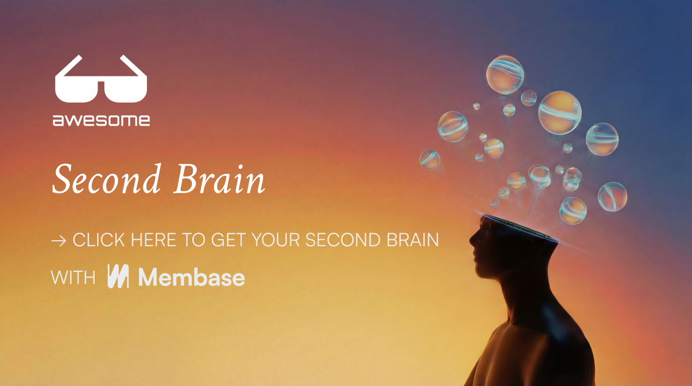

# Awesome AI Second Brain

[English](README.md) | 한국어

> 여러 도구, 정보원, 업무 흐름에 흩어진 나와 팀의 맥락을 이해하는 자가 발전형 세컨드 브레인을 만들기 위한 가이드입니다.

이 레포는 AI가 개인의 맥락, 팀 지식, 업무 히스토리를 이해하게 만들고 싶은 사람들을 위한 세컨드 브레인, AI memory, 지식 시스템 비교 자료입니다. 흩어진 맥락을 수집하고, 오래 쓸 수 있는 지식으로 정리하고, 시간이 지나도 계속 업데이트하며, 사람과 AI 도구가 실제 작업에서 활용할 수 있게 만드는 전체 생애주기를 기준으로 봅니다.

## 세컨드 브레인 생애주기

이 레포는 세컨드 브레인을 처음부터 끝까지 어떻게 만들지 판단하는 데 초점을 둡니다.

| 단계 | 핵심 질문 | 비교할 것 |
|---|---|---|
| 수집 | 채팅, 문서, 앱, 노트, 캘린더, Slack, 이메일, 코드, 파일의 맥락이 어떻게 브레인으로 들어오는가? | 커넥터, 가져오기, API, 수동 노트, 커스텀 수집기 |
| 정리 | 원본 맥락이 단순 임베딩 더미가 아니라 구조화된 지식이 되는가? | 엔티티, 사실, 링크, 요약, 타임라인, 태그, Wiki/page |
| 발전 | 새 맥락이 들어오고 오래된 맥락이 낡아갈 때 memory가 개선되는가? | 통합, 중복 제거, 정정, 갱신, dream/maintenance loop |
| 활용 | 사람이나 AI 도구가 실제 작업할 때 필요한 맥락을 바로 찾고 적용할 수 있는가? | 검색, 근거 제시, 필터, 인용, AI 도구 접근, 쓰기 반영 |
| 관리 | 사용자와 팀이 브레인을 확인, 수정, 삭제, 내보내기, 범위 지정, 신뢰할 수 있는가? | UI, 출처, 권한, 개인/팀 경계, 로컬/클라우드 통제 |

## 주 제약 기준으로 고르기

아래 표는 분류표가 아니라 선택 가이드입니다. 지금 가장 중요한 제약에 맞춰 시작점을 고르면 됩니다. 많은 시스템은 여러 용도에 동시에 해당합니다.

| 지금 가장 중요한 제약 | 먼저 볼 것 | 이유 |
|---|---|---|
| 운영 부담이 낮은 end-to-end 설정 | [Membase](ko/solutions/membase.md) | 로컬 수집기, 그래프 작업, memory 인프라를 직접 운영하지 않고도 맥락을 수집하고 Memory/Wiki로 정리한 뒤 대시보드 채팅이나 AI workflow에서 활용할 수 있는 호스팅형 설정입니다. |
| 로컬 또는 self-hosted 통제권 | [OpenHuman](ko/solutions/openhuman.md), [GBrain](ko/solutions/gbrain.md), [Hermes Agent + LLM Wiki](ko/solutions/hermes-llm-wiki.md), [Mnemosyne](ko/solutions/mnemosyne.md), [Khoj](ko/solutions/khoj.md), [Obsidian/Logseq + AI bridge](ko/solutions/obsidian-logseq.md) | 데이터가 로컬 파일이나 self-hosted 서비스에 남을 수 있지만, 설정, 동기화, 인덱싱, 유지보수를 더 많이 직접 책임져야 합니다. |
| 강한 지식 정리 또는 graph memory | [Membase](ko/solutions/membase.md), [GBrain](ko/solutions/gbrain.md), [Hermes Agent + LLM Wiki](ko/solutions/hermes-llm-wiki.md), [Mnemosyne](ko/solutions/mnemosyne.md), [Hyperspell](ko/solutions/hyperspell.md), [Honcho](ko/solutions/honcho.md), [Zep/Graphiti](ko/solutions/zep-graphiti.md), [Cognee](ko/solutions/cognee.md) | 엔티티, 링크, 사실, wiki page, context graph, 그래프 구조, representation, 시간성 memory가 지식 검색과 유지보수의 핵심 요소가 됩니다. |
| 개발자용 memory API | [Mem0/OpenMemory](ko/solutions/mem0-openmemory.md), [Honcho](ko/solutions/honcho.md), [Hindsight](ko/solutions/hindsight.md), [Mnemosyne](ko/solutions/mnemosyne.md), [Supermemory](ko/solutions/supermemory.md), [Hyperspell](ko/solutions/hyperspell.md), [Zep/Graphiti](ko/solutions/zep-graphiti.md), [Cognee](ko/solutions/cognee.md) | 앱 개발자를 위한 API, SDK, MCP, 관리형 서비스를 제공합니다. |
| 제한된 자료 연구 또는 플랫폼 내 개인화 | [NotebookLM](ko/solutions/notebooklm.md), [ChatGPT Memory](ko/solutions/chatgpt-memory.md), [Claude Projects/Claude Code](ko/solutions/claude-projects-code.md) | 하나의 notebook, 자료 묶음, AI 플랫폼 안에서 작업할 때 유용합니다. |

## 솔루션 계층

완성형 세컨드 브레인 앱과 backend memory substrate를 같은 역할처럼 비교하지 않기 위해 계층 라벨을 사용합니다. 사용자가 먼저 채택하는 대상이 앱인지, workspace인지, API layer인지, substrate인지, platform feature인지에 따라 분류합니다. 일부 시스템은 여러 계층에 걸쳐 있지만, 여기서는 이 레포가 평가하는 주 역할을 기준으로 표시합니다.

| 계층 | 의미 | 예시 |
|---|---|---|
| End-to-end app | 수집, 정리, 검색, 사용자-facing workflow가 함께 패키징되어 있습니다. | [Membase](ko/solutions/membase.md), [OpenHuman](ko/solutions/openhuman.md), [Khoj](ko/solutions/khoj.md) |
| Local workspace | 사용자가 로컬 파일, wiki page, vault, self-hosted brain을 소유하고 에이전트가 그 위에서 작업합니다. | [GBrain](ko/solutions/gbrain.md), [Hermes Agent + LLM Wiki](ko/solutions/hermes-llm-wiki.md), [Obsidian/Logseq + AI bridge](ko/solutions/obsidian-logseq.md) |
| Agent memory layer | 에이전트나 제품에 memory를 붙이기 위한 API, SDK, MCP server, 관리형 서비스를 제공합니다. | [Mem0/OpenMemory](ko/solutions/mem0-openmemory.md), [Honcho](ko/solutions/honcho.md), [Hindsight](ko/solutions/hindsight.md), [Mnemosyne](ko/solutions/mnemosyne.md), [Supermemory](ko/solutions/supermemory.md), [Hyperspell](ko/solutions/hyperspell.md) |
| Memory substrate | 애플리케이션이 그 위에 구축하는 graph, retrieval, knowledge infrastructure에 가깝습니다. | [Zep/Graphiti](ko/solutions/zep-graphiti.md), [Cognee](ko/solutions/cognee.md) |
| Platform baseline | 하나의 AI platform 또는 제한된 research surface 안의 memory/context 기능입니다. | [ChatGPT Memory](ko/solutions/chatgpt-memory.md), [Claude Projects/Claude Code](ko/solutions/claude-projects-code.md), [NotebookLM](ko/solutions/notebooklm.md) |

## 운영 부담이 낮은 End-to-End 경로

[Membase](https://membase.so/?utm_source=github&utm_medium=awesome-second-brain)는 운영 부담을 낮게 유지하면서 빠르게 유용한 세컨드 브레인을 만들고 싶을 때 가장 자연스러운 시작점입니다. AI 채팅과 연결된 정보원에서 맥락을 수집하고, Memory와 Wiki로 정리한 뒤, 대시보드 채팅이나 연결된 AI 도구에서 그 지식을 바로 활용할 수 있게 하는 전체 루프에 초점을 둡니다. 로컬 소유권이나 self-hosted infrastructure가 최우선이면 local workspace 선택지부터 보는 편이 낫습니다.

## 솔루션 스냅샷

이 스냅샷은 서로 다른 계층의 솔루션을 주 적합도와 트레이드오프 중심으로 비교합니다. 수집, 정리, 발전, 활용, 거버넌스를 포함한 자세한 생애주기 비교는 [Capability Matrix](ko/comparisons/capability-matrix.md)를 보세요.

### End-To-End Apps

| 솔루션 | 주 적합도 | 이럴 때 적합 | 주요 트레이드오프 |
|---|---|---|---|
| [Membase](ko/solutions/membase.md) | 호스팅형 second brain | 로컬 수집기, graph job, memory infrastructure를 운영하지 않고 cross-tool second brain을 만들고 싶을 때. | 호스팅 경로라 local infrastructure control은 상대적으로 낮습니다. |
| [OpenHuman](ko/solutions/openhuman.md) | Local-first personal AI assistant | 자동 앱 수집과 제품화된 로컬 데스크톱 assistant를 원할 때. | 초기 beta 상태와 로컬 설정 세부사항은 달라질 수 있습니다. |
| [Khoj](ko/solutions/khoj.md) | 파일과 노트 위의 개인 AI | 로컬 노트, 파일, 문서, 웹 source 위에서 chat/search를 원할 때. | full memory governance보다는 personal assistant/search에 더 가깝습니다. |

### Local Workspaces

| 솔루션 | 주 적합도 | 이럴 때 적합 | 주요 트레이드오프 |
|---|---|---|---|
| [GBrain](ko/solutions/gbrain.md) | 로컬/self-hosted brain operations | agent가 page, graph, timeline, CLI/MCP, maintenance job이 있는 구조화된 local brain을 운영하길 원할 때. | 설정과 운영 책임이 더 큽니다. |
| [Hermes Agent + LLM Wiki](ko/solutions/hermes-llm-wiki.md) | 에이전트가 운영하는 Markdown wiki | 에이전트가 compile, query, lint, maintain할 수 있는 확인 가능한 local wiki를 원할 때. | wiki 관리 규칙과 workflow 설계는 사용자가 책임져야 합니다. |
| [Obsidian/Logseq + AI bridge](ko/solutions/obsidian-logseq.md) | 사람이 소유하는 로컬 지식 베이스 | local PKM source of truth를 유지하면서 선택적으로 AI bridge를 붙이고 싶을 때. | AI memory 동작은 plugin, import, custom bridge에 의존합니다. |

### Agent Memory Layers

| 솔루션 | 주 적합도 | 이럴 때 적합 | 주요 트레이드오프 |
|---|---|---|---|
| [Supermemory](ko/solutions/supermemory.md) | 호스팅형 memory API와 connector | AI workflow나 제품에 hosted memory, connector, MCP, API, SDK, plugin이 필요할 때. | retrieved context가 실제로 어떻게 쓰였는지는 app owner가 검증해야 합니다. |
| [Hyperspell](ko/solutions/hyperspell.md) | 호스팅형 company/user context layer | workspace context, metadata, live search, procedural memory, agent-facing API가 필요할 때. | private beta와 제품 availability가 도입에 영향을 줄 수 있습니다. |
| [Honcho](ko/solutions/honcho.md) | Stateful agent memory와 user modeling | peer representation, conclusion, session context, 사용자 또는 agent modeling을 시간에 따라 유지해야 할 때. | developer integration과 hosting 선택이 중요합니다. |
| [Hindsight](ko/solutions/hindsight.md) | memory bank가 있는 agent memory API | agent에 memory bank, observation, consolidation, multi-mode recall이 필요할 때. | retrieval-to-action evidence는 주변 workflow에 달려 있습니다. |
| [Mnemosyne](ko/solutions/mnemosyne.md) | Local-first agent memory layer | MCP, SDK, CLI, Hermes integration, tier, consolidation이 있는 local SQLite memory가 필요할 때. | local operation과 agent logging은 사용자가 챙겨야 합니다. |
| [Mem0/OpenMemory](ko/solutions/mem0-openmemory.md) | 개발자용 memory engine | hosted 또는 self-hosted 경로로 app에 user/run-scoped memory를 붙이고 싶을 때. | 완성형 second-brain workflow라기보다 app memory primitive에 가깝습니다. |

### Memory Substrates

| 솔루션 | 주 적합도 | 이럴 때 적합 | 주요 트레이드오프 |
|---|---|---|---|
| [Zep/Graphiti](ko/solutions/zep-graphiti.md) | Temporal graph memory substrate | 애플리케이션 아래에 temporal graph memory와 Graph RAG가 필요할 때. | 그 자체로 완성형 user-facing second brain은 아닙니다. |
| [Cognee](ko/solutions/cognee.md) | Knowledge graph memory SDK | SDK, MCP, API, plugin, cloud path가 있는 graph-oriented memory infrastructure가 필요할 때. | 그 위에 application이나 workflow integration이 필요합니다. |

### Platform Baselines

| 솔루션 | 주 적합도 | 이럴 때 적합 | 주요 트레이드오프 |
|---|---|---|---|
| [ChatGPT Memory](ko/solutions/chatgpt-memory.md) | ChatGPT-native personalization | 이미 ChatGPT 안에서 일하고 있고 platform-local personalization이 필요할 때. | visibility, retrieval, export가 platform-controlled입니다. |
| [Claude Projects/Claude Code](ko/solutions/claude-projects-code.md) | Claude 범위의 프로젝트 지식 | 작업이 Claude Projects, Claude Code, Claude connector 안에 있을 때. | context가 Claude workflow와 plan/workspace control에 묶입니다. |
| [NotebookLM](ko/solutions/notebooklm.md) | 출처 기반 research notebook | 제한된 source set 위에서 grounded work가 필요할 때. | cross-tool evolving second brain으로 설계된 것은 아닙니다. |

## Deep Dives

| Page | 용도 |
|---|---|
| [Chooser](ko/comparisons/chooser.md) | 목표와 트레이드오프에 맞는 시작 솔루션 고르기 |
| [Solution Layers](ko/comparisons/solution-layers.md) | End-to-end app, local workspace, agent memory layer, memory substrate, platform baseline 구분 |
| [Capability Matrix](ko/comparisons/capability-matrix.md) | 생애주기 지원, 거버넌스, 운영 부담, 활용 채널, 설정 시간 비교 |
| [Capability Definitions](ko/capabilities/README.md) | 매트릭스 뒤의 평가 축 이해하기 |
| [Setup Burden](ko/comparisons/setup-burden.md) | 실제로 무엇을 운영해야 하는지 보기 |
| [Agent Activation](ko/comparisons/agent-access.md) | MCP, API, SDK, CLI, plugin access를 세컨드 브레인 활용 채널로 비교 |
| [Local vs Cloud](ko/comparisons/local-vs-cloud.md) | memory가 어디에 있어야 하는지 결정 |
| [Personal vs Team](ko/comparisons/personal-vs-team.md) | 개인, 프로젝트, 팀, 조직 적합도 비교 |
| [Setup Guides](ko/setup-guides/README.md) | 검증된 직접 설정 노트 추가 기준 |
| [Examples](ko/examples/README.md) | 구체적인 세컨드 브레인 workflow와 시나리오 |
| [Watchlist](ko/watchlist.md) | 아직 완전히 평가되지 않은 유망 시스템 |

## 평가 라벨

| Label | 의미 |
|---|---|
| 내장 | 제품이 해당 workflow를 직접 지원합니다. |
| 연동 | 문서화된 커넥터, 플러그인, SDK, bridge가 있습니다. |
| 커스텀 수집기 | 가능하지만 정보원별 코드, OAuth, 속도 제한, 정규화 등을 직접 운영해야 합니다. |
| 부분 지원 | 유용한 지원은 있지만 workflow가 불완전하거나 특정 플랫폼 안에 묶여 있습니다. |
| 주 용도 아님 | 해당 workflow를 위해 설계된 솔루션은 아닙니다. |
| 미확인 | 아직 이 레포에서 검증하지 않은 주장입니다. |

설정 시간은 `공식`, `직접 설정`, `관리자/maintainer 추정`으로 구분합니다. 공식 quickstart는 있지만 신뢰할 수 있는 시간 추정이 없으면 실제 소요 시간이 달라진다고 표시합니다.

## 출처

핵심 주장은 공식 문서, 공식 저장소, 로컬 직접 검증 리포트로 뒷받침되어야 합니다. 이 레포는 설치 명령을 길게 복사하기보다 공식 설정 문서로 연결하는 것을 우선합니다.

## 기여 방법

1. 솔루션, 기능 축, 비교 문서, 설정 가이드, 예시, watchlist 항목 중 하나를 고릅니다.
2. [ko/templates/system-profile.md](ko/templates/system-profile.md) 또는 [ko/templates/capability-page.md](ko/templates/capability-page.md)를 사용합니다.
3. 1차 출처를 사용하거나, 검증되지 않은 필드는 `미확인`으로 표시합니다.
4. 관련 기능 축과 비교 문서에서 솔루션을 링크합니다.
5. 출처와 검증 메모를 포함해 PR을 엽니다.

자세한 내용은 [ko/CONTRIBUTING.md](ko/CONTRIBUTING.md)를 참고하세요.

## Star History

<a href="https://www.star-history.com/?repos=aristoapp%2Fawesome-second-brain&type=date&legend=top-left">
 <picture>
   <source media="(prefers-color-scheme: dark)" srcset="https://api.star-history.com/chart?repos=aristoapp/awesome-second-brain&type=date&theme=dark&legend=top-left" />
   <source media="(prefers-color-scheme: light)" srcset="https://api.star-history.com/chart?repos=aristoapp/awesome-second-brain&type=date&legend=top-left" />
   
 </picture>
</a>
